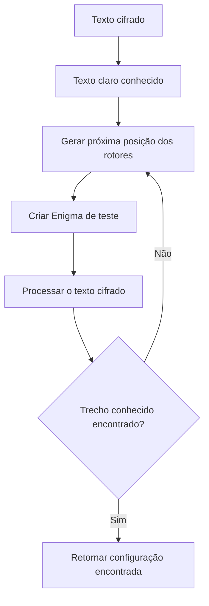
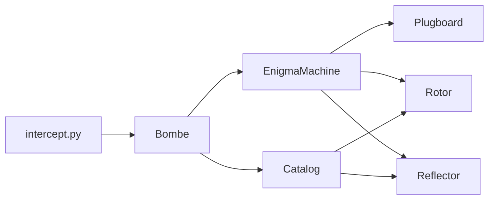
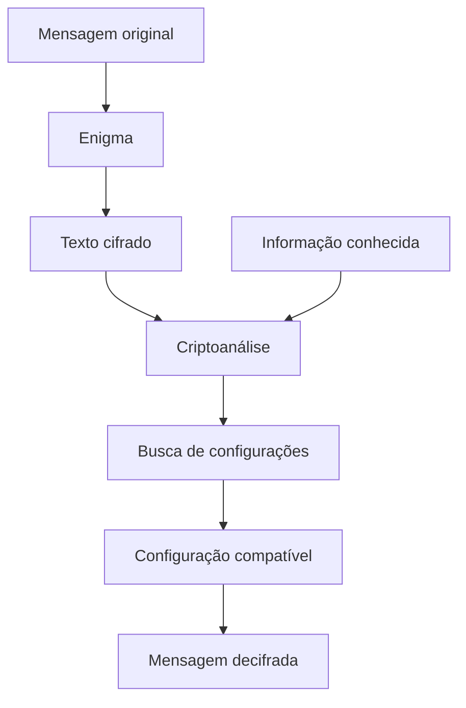

# 🕵️ Módulo de Criptoanálise

Este diretório contém a implementação do processo de **criptoanálise** utilizado pelo simulador para buscar a configuração inicial dos rotores da máquina Enigma.

A implementação utiliza informações conhecidas sobre a mensagem original para testar diferentes configurações da máquina até encontrar uma posição compatível com o texto conhecido.

## 🧩 Estrutura do Módulo

```text
cryptanalysis/
├── README.md
├── __init__.py
└── bombe.py
```

## 🧠 `bombe.py`

Implementa a classe `Bombe`, responsável pelo processo de busca da configuração da Enigma.

A classe recebe informações que permanecem fixas durante a busca, como:

* rotor esquerdo;
* rotor central;
* rotor direito;
* refletor;
* conexões conhecidas do plugboard.

As posições iniciais dos três rotores são então testadas sistematicamente.

### 🏭 `_criar_maquina_teste()`

Este método cria uma nova `EnigmaMachine` para cada posição inicial testada.

Para isso, são criados:

1. um novo `Plugboard`;
2. três `Rotor`;
3. um `Reflector`;
4. uma nova `EnigmaMachine` utilizando esses componentes.

A criação de uma máquina independente para cada tentativa garante que cada configuração seja testada a partir de seu estado inicial.

### 🔎 `quebrar_posicao()`

Este método executa a busca pela posição inicial dos rotores.

O processo utiliza todas as combinações possíveis das três posições:

```text
26 × 26 × 26 = 17.576 posições
```

Para cada combinação, o método:

1. cria uma nova máquina Enigma;
2. utiliza a posição atual dos rotores;
3. processa o texto cifrado;
4. verifica se o resultado contém o trecho de texto claro conhecido;
5. retorna a configuração quando uma correspondência é encontrada.

Caso nenhuma configuração seja compatível com o texto conhecido, o método retorna `None`.

## 🔍 Fluxo da Busca



A busca termina assim que uma configuração compatível é encontrada.

## 🔗 Relação com o Módulo Enigma

A criptoanálise não implementa novamente os componentes da Enigma. Em vez disso, `bombe.py` reutiliza diretamente as classes e funções do módulo `enigma`.



Essa relação permite que o processo de busca utilize o mesmo comportamento da máquina empregado na etapa de criptografia.

## 🎯 Objetivo da Criptoanálise

O objetivo do módulo é encontrar uma configuração dos rotores que produza um resultado compatível com uma informação conhecida sobre a mensagem original.

O fluxo geral do processo é:



Dessa maneira, o módulo representa a etapa de ataque do simulador, enquanto o módulo `enigma` fornece a implementação da máquina utilizada durante os testes.

## 🧩 Papel do Módulo no Projeto

O módulo `cryptanalysis` complementa o módulo `enigma` ao utilizar sua implementação para realizar a busca pela configuração desconhecida.

Enquanto `enigma/` é responsável pelo funcionamento da máquina, `cryptanalysis/` utiliza essa máquina como base para testar sistematicamente diferentes possibilidades até encontrar uma configuração compatível com as informações conhecidas.
