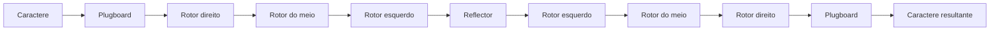
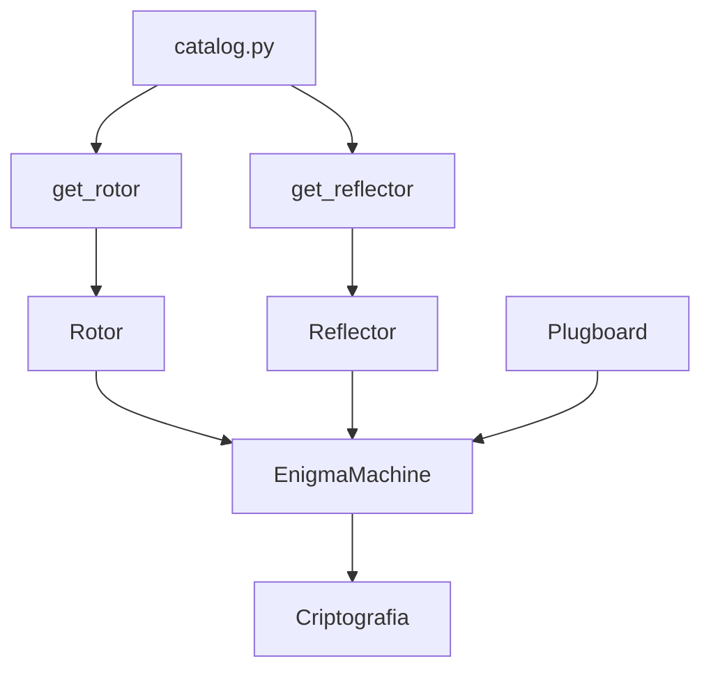

# 🔐 Módulo Enigma

Este diretório contém a implementação da máquina de criptografia **Enigma** utilizada pelo simulador.

A implementação foi dividida em componentes que representam as principais partes da máquina e em uma classe responsável por coordenar o funcionamento completo da criptografia. Dessa forma, cada componente possui uma responsabilidade específica, enquanto `EnigmaMachine` integra todos eles.

## 🧩 Estrutura do Módulo

```text
enigma/
├── README.md
├── __init__.py
├── catalog.py
├── enigma_machine.py
├── plugboard.py
├── reflector.py
└── rotor.py
```

## ⚙️ Componentes

### 🔄 `rotor.py`

Implementa a classe `Rotor`, responsável pelo comportamento individual de um rotor da Enigma.

Cada rotor possui:

* uma **fiação interna** (`wiring`), responsável pelo mapeamento das 26 letras;
* uma **posição atual**, que representa a letra exibida na janela do rotor;
* um **notch**, utilizado no avanço dos rotores.

A classe possui três responsabilidades principais:

* `step()` avança o rotor em uma posição;
* `forward()` processa o sinal no sentido de entrada do rotor;
* `backward()` processa o sinal no sentido inverso.

Os métodos de processamento consideram a posição atual do rotor para aplicar os deslocamentos necessários antes e depois da transformação realizada pela fiação.

### 🔁 `reflector.py`

Implementa a classe `Reflector`, responsável pelo refletor da Enigma.

O refletor utiliza uma fiação fixa de 26 caracteres e realiza o mapeamento por meio do método `reflect()`.

Durante a inicialização, a classe também valida a configuração recebida, garantindo que uma letra não seja refletida para si mesma.

### 🔌 `plugboard.py`

Implementa a classe `Plugboard`, responsável pelas conexões configuradas pelo operador.

As conexões são armazenadas de forma bidirecional. Por exemplo:

```text
A ↔ B
C ↔ D
```

A classe valida as conexões para evitar:

* pares com quantidade incorreta de letras;
* uma letra conectada a si mesma;
* uma mesma letra utilizada em múltiplas conexões.

O método `swap()` realiza a substituição de acordo com as conexões configuradas. Letras que não possuem uma conexão permanecem inalteradas.

### 🗂️ `catalog.py`

Centraliza as configurações dos rotores e refletores utilizados pelo simulador.

O arquivo contém as fiações dos rotores I, II, III, IV e V, seus respectivos notches e as configurações dos refletores B e C.

Também fornece funções para criar os componentes necessários:

* `get_rotor()` cria um rotor a partir do modelo e da posição inicial;
* `get_reflector()` cria um refletor a partir do modelo informado.

Isso permite que os demais módulos solicitem os componentes sem precisar conhecer diretamente suas fiações.

### ⚙️ `enigma_machine.py`

Implementa a classe `EnigmaMachine`, responsável por integrar os componentes anteriores e executar o processo completo de criptografia.

A máquina recebe:

* um `Plugboard`;
* três `Rotor`;
* um `Reflector`.

O processamento de cada caractere segue o fluxo:



Antes do processamento, o rotor da direita avança. O avanço dos demais rotores depende da posição de seus notches.

O método `process_char()` executa o processamento de um caractere individual, enquanto `process_message()` aplica esse processo a toda a mensagem.

## 🔗 Relação entre os Componentes

Os componentes do módulo possuem responsabilidades distintas, mas trabalham em conjunto através de `EnigmaMachine`.



`catalog.py` fornece as configurações dos componentes, enquanto `EnigmaMachine` coordena o funcionamento da máquina.

## 🧠 Papel do Módulo no Projeto

O módulo `enigma` é a base do simulador.

Ele é utilizado diretamente pela aplicação principal para realizar a criptografia e também pela etapa de criptoanálise para reproduzir o comportamento da máquina em diferentes configurações.

Assim, a mesma implementação da Enigma é utilizada tanto para gerar o texto cifrado quanto para testar configurações durante o processo de recuperação da chave.
